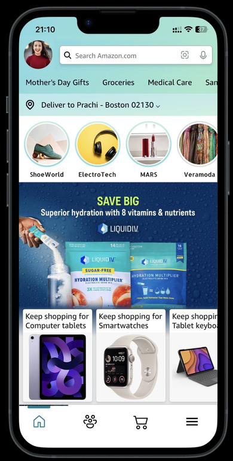
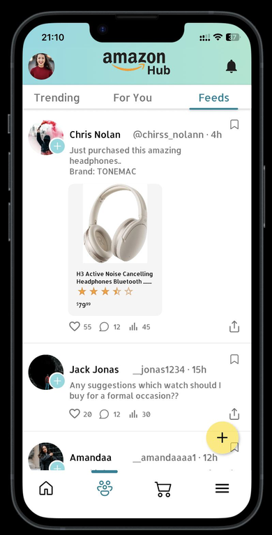
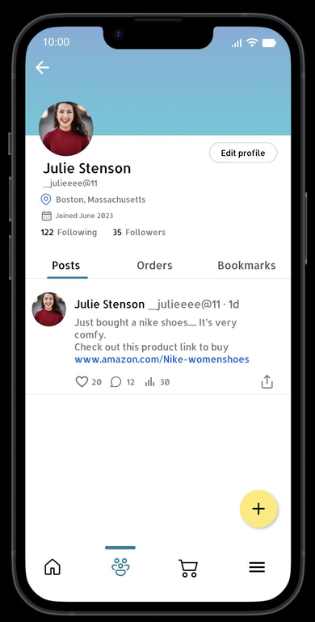
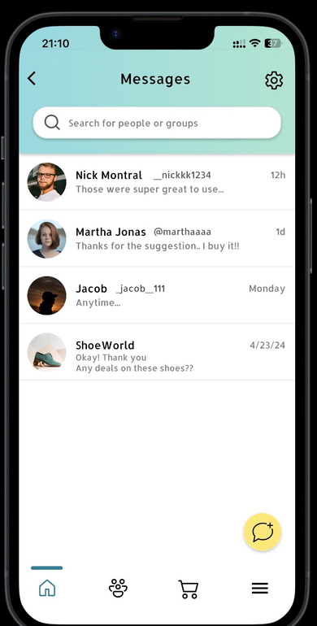
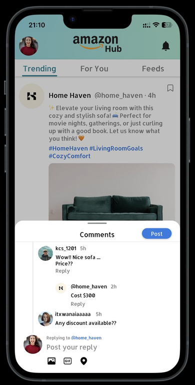
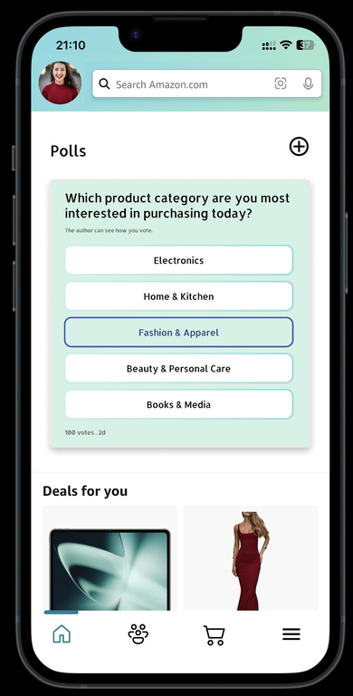
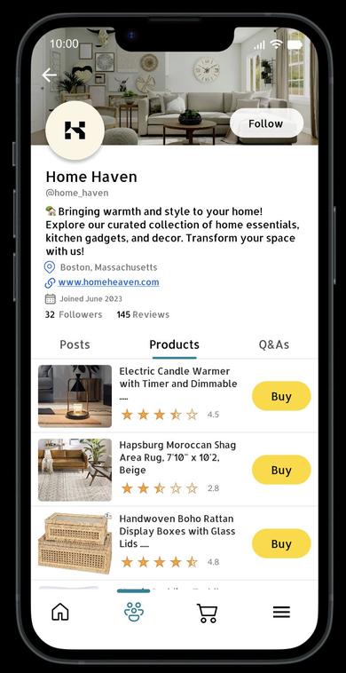
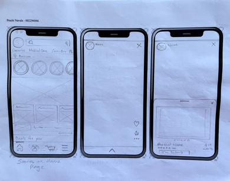
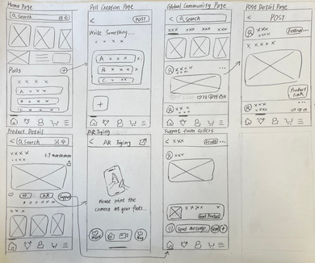
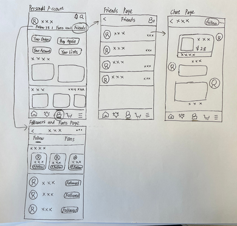

# 🛒 Amazon Hub
### *Shop, Share, and Connect: Your Hub for Social Shopping*

**A UX/UI design concept that integrates social media features into the Amazon ecosystem — giving users a community-driven shopping experience without leaving the platform.**

---

## 📱 App Screens Preview

<table>
  <tr>
    <td align="center"><b>🏠 Home Feed</b></td>
    <td align="center"><b>📸 Stories</b></td>
    <td align="center"><b>👥 Community</b></td>
    <td align="center"><b>💬 Chat</b></td>
  </tr>
  <tr>
    <td></td>
    <td></td>
    <td></td>
    <td></td>
  </tr>
  <tr>
    <td align="center"><b>🏪 Vendor Page</b></td>
    <td align="center"><b>🛍️ Product Detail</b></td>
    <td align="center"><b>📰 Social Feed</b></td>
    <td align="center"></td>
  </tr>
  <tr>
    <td></td>
    <td></td>
    <td></td>
    <td></td>
  </tr>
</table>

---

## 💡 The Problem

With the instability of X (formerly Twitter), millions of users began searching for a reliable alternative platform for social interaction and content sharing. Meanwhile, Amazon — with its massive existing user base — had no social layer to engage users beyond transactional shopping.

**The opportunity:** Build a social shopping experience inside the Amazon ecosystem that captures displaced social media users while enhancing the existing shopping experience.

> *Can we create a community in the Amazon app for users like X?*
> *Can we advertise products through user-generated content, just like tweets?*
> *Can we improve customer service through direct chat with vendors?*

---

## 🎯 Target Users

- Shoppers who rely on **consumer reviews and recommendations** before purchasing
- Active social media users who enjoy sharing and viewing content
- Users who want a **combined social + shopping** experience
- All age groups — with a focus on intuitive, easy navigation

---

## ✨ Key Features Designed

### 📸 Stories for Product Advertising
Short stories to advertise and showcase products — giving vendors a native way to reach users in a familiar, Instagram-style format.

### 📊 Community Polls
Vote-based polls to gather customer opinions on products — driving engagement and helping vendors understand preferences.

### 👥 Community Page
A dedicated community space where users can interact, share content, view product posts, and exchange feedback — all within Amazon.

### 💬 Vendor Chat
Direct messaging with vendors or other users — making it easy to ask product questions, get support, and share feedback in real time.

### 🎨 Amazon Design Language
Maintained Amazon's existing color theme and UI patterns throughout — ensuring user familiarity and reducing the learning curve for existing Amazon customers.

---

## 🔄 Design Process

### 1. Design Sprint
Conducted a team design sprint to analyze the problem space, starting with rapid competitive research — exploring both X and the Amazon app to identify gaps and opportunities.

### 2. Hand Sketches & Dot Voting

Each team member independently sketched initial UI ideas. The group then used **dot voting** — each person received 10 dots to vote on the most attractive and important features across all sketches — directing the individual design direction.

### 3. High-Fidelity Prototypes

Built high-fidelity prototypes in Figma using the **snapshot method** for large UI components, enabling faster iteration on Amazon's complex UI patterns.

<table>
  <tr>
    <td></td>
    <td></td>
  </tr>
</table>

### 4. Usability Testing

Conducted usability testing with **5 participants** across 4 core task flows:

| Task | Flow |
|---|---|
| Task 1 | Navigate Stories and interact with Polls |
| Task 2 | Navigate to Community Page and explore |
| Task 3 | Navigate Vendor Page and explore products |
| Task 4 | Send a message via Chat |

**Key feedback from participants:**
- ✅ "Interesting feature to advertise products"
- ✅ "Poll card design is great"
- ✅ "Very appealing, easy navigation to product detail page"
- ✅ "Great way to connect, share, get feedback for products"
- ✅ "Feels like usual chat window in any other social media app"
- 💬 "Try reducing the size of the circle"
- 💬 "Comment font was too small"
- 💬 "Color of the follow button can be blue"

---

## 📊 Outcome Analysis

### Risks Identified
- Users may find Twitter-like elements cluttered if poorly executed
- Social features could feel like distractions if not meaningfully integrated
- Competing platforms with stronger social features could pull users away

### Potential Impact for Amazon
- Higher customer satisfaction through better vendor communication
- More accurate product recommendations driven by social interactions
- Increased conversion rates through community-generated content

---

## 🛠️ Tools Used

---

## 💭 Reflection

**What went well**
- Collaborative ideation in the design sprint led to a well-rounded solution
- Using Amazon's snapshot method made it efficient to build large, complex UI components
- Learned new Figma techniques and design sprint methodologies

**What could be improved**
- More creative and innovative features could be explored
- Conduct additional user interviews outside the classroom with real Amazon users
- Limited time meant not all designed pages were fully prototyped

---

## 🔗 Live Prototype

👉 **[Click to view the interactive Figma prototype](https://www.figma.com/proto/fhSxY4jqSkUjfwUTW0r1oJ/PrachiNavale_Spring24?page-id=934%3A2&type=design&node-id=1473-4890&t=zEZoGB5yIZweaDBN-0&scaling=scale-down&starting-point-node-id=1473%3A4886&content-scaling=fixed)**

---

## 👩‍💻 Author

**Prachi Navale** — Fullstack Software Engineer · MS Information Systems, Northeastern University

---

  <i>Designed as part of a UX Design Sprint — Spring 2024, Northeastern University</i>

